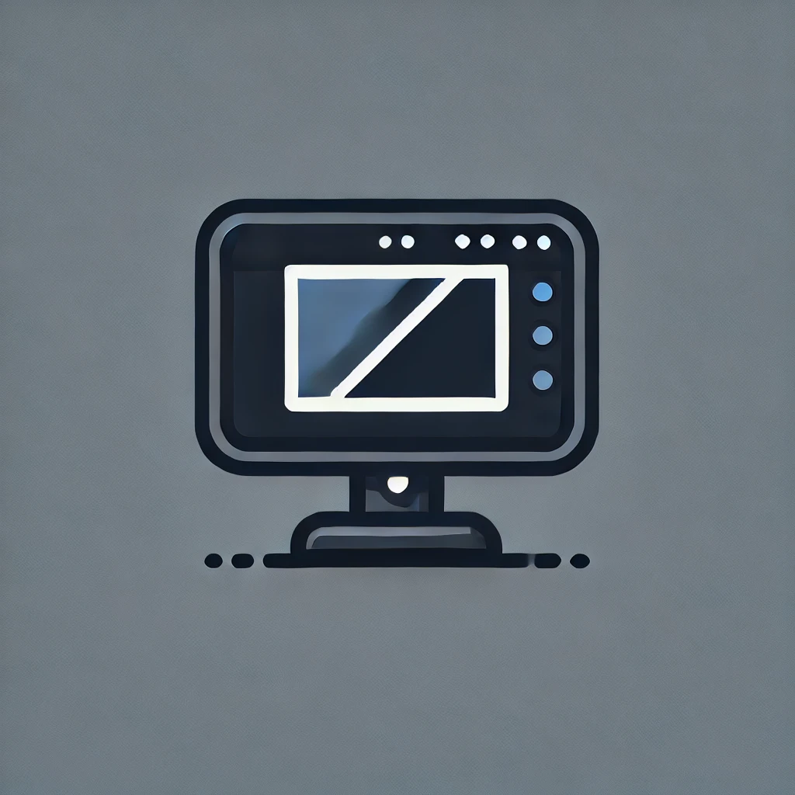

<p align="center">
    
</p>

<h1 align="center">DeskShare</h1>
DeskShare is a lightweight system-tray application that allows you to easily share your selected virtual desktop on Windows. With DeskShare, you can easily share your preferred virtual desktop in any screen-cast tool or online meeting platform.
`Note: The executable is not code-signed at the moment. Windows might throw a security warning as a result.`


## How to Use
1. Install and run the application through the executable in `Releases`, or through python:  

    ```python
    python main.py
    ```
2. Right-click the tray icon, and select the desktop you want to share.
    > *This will create a new fullscreen window that is gray initially. It will start broadcasting the virtual desktop once it is active*  
3. Select the broadcasting window from the screen-sharing platform you are using
    > *`Tip: Move the broadcasting window to a separate virtual desktop since it covers the fullscreen`*


